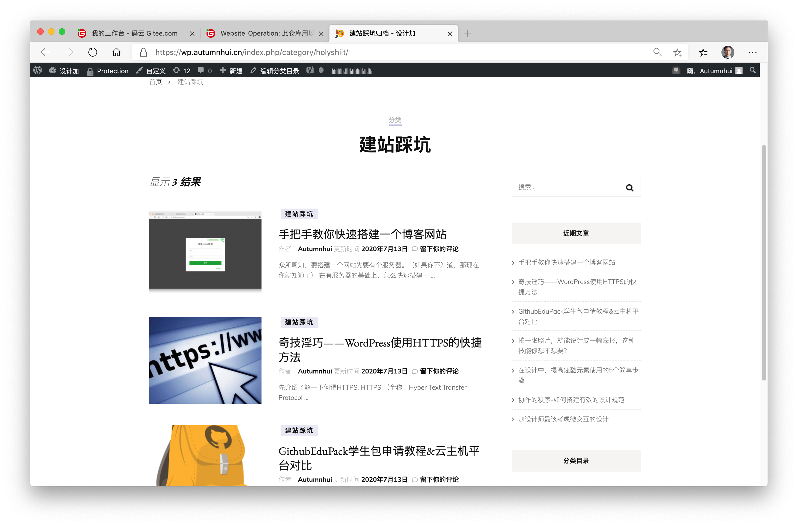
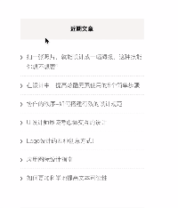
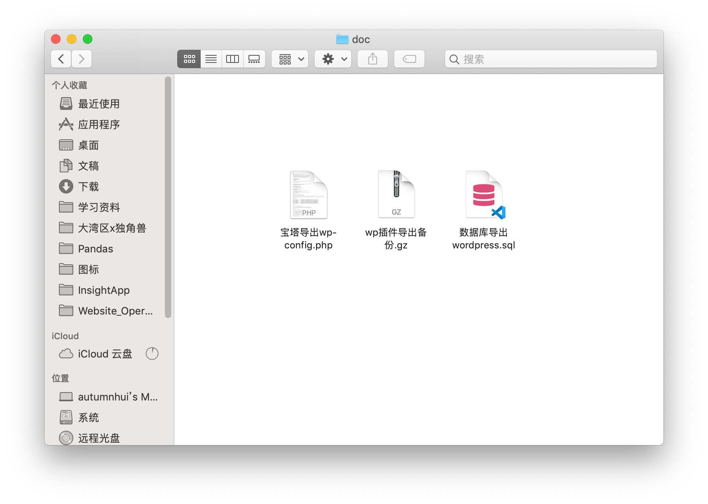

# 🌏Website_Operation

## 1.策划文档与网站地图

### 1.1 网站建设目标

“设计加”是一个分享平面设计、图标设计、字体设计等方面的知识资料的网站，目的在于提供一个设计师/对设计方面有兴趣的人士提供学习交流的平台。

### 1.2 目标用户画像

- 老八：35岁的男性职业设计师，从大学毕业开始从事设计行业，经常要在互联网上寻找相关资料，并且天天学习相关内容。
- 小乔：21岁的女性设计师，刚大学毕业，喜欢在网上冲浪，经常在网上学习设计相关的知识，喜欢跟别人交流学习。

### 1.3 网站规划

| 阶段 | 规划 |
|:--:|:--:|
|前期|提供各类设计相关的资料以供用户阅读学习，并且开放交流。|
|中期|在各类大型网站引流；开放用户可发表/分享文章，经筛选后发布在网站上；根据用户反馈优化网站。|
|后期|持续根据用户反馈优化网站；接广告盈利。|

### 1.4 DVF模型描述

> D：Desirability 用户需求

> V: Viability 可持续性

> F：Feasibility 可行性
  
|模型|内容|
|:---:|:---:|
|需求Desirability|根据查找发现，能够提供交流的设计分享平台并不多，导致有问题的用户不知从何得到答案。|
|可持续性Viability|定期更新网站资料内容，增加用户粘性；开放用户的可使用性。|
|可行性Feasibility|市面上的相关产品数量少，且设计行业的热度一直不减，属于风口上的产业，建设此网站后续发展、可行性高。|

### 1.5 网站地图

# 2. 图片使用

## 2.1 版权说明

文章来源为 [图翼网](http://tuyiyi.com)，因网页为设计相关内容，图片数量较多，故在每篇文章开头已注明文章&图片的来源信息（对应URL)。

更多详情[传送门](https://wp.autumnhui.cn)

## 2.2 配色风格

网站整体以白色为背景，主色为#B2B1DB，采用此配色柔和而不失对比，舒适且不刺眼。让用户在使用的过程中能舒适地阅读文章内容。网站首页展示的图片为文章内的特色图片，柔和且清晰的配色风格让用户能够舒适地浏览网页。

# 3. 云端架站/运维图文

详细点击[传送门](https://wp.autumnhui.cn/index.php/category/holyshiit/)

# 4. 平面设计

## 4.1 可读性相关

- 页面为白色背景，主色为#B2B1DB，柔和而不失对比，舒适且不刺眼。
  > #B2B1DB颜色样本。#B2B1DB是色相241度，彩度19%，明度85%的颜色。在RGB的值中，Red是“178”Green是“177”Blue是“219”。色相相近的颜色有“绀桔梗”、“藤储户”、“宝石蓝”、“Eliotropo”等。
- 标题字体：60px
- 首页置顶文章标题：38px
- 首页非置顶文章标题：20px
- 鼠标悬浮未点击时动态效果反馈

**总结**

可读性较强，用户使用的反馈感受明显；字体清晰明了；配色风格相对中性，和谐不违和。

## 4.2 插件运用

### 4.1 Animate it! 两处使用

- 搜索框抖动

当滑鼠悬浮时，提醒用户已经进入搜索框，引导用户能够进行搜索操作。

- 近期文章放大

当滑鼠悬浮时，近期文章模块会放大提示，强调最近更新的文章的优先级。

### 4.2 SiteOrigin

1. [文章1](https://wp.autumnhui.cn/index.php/2020/07/12/use-https/) 在文章中使用siteorigin小工具添加阅读进度条。

2. [文章2](https://wp.autumnhui.cn/index.php/2020/07/10/get-githubedupack/) 在文章结尾使用Siteorigin添加跳转到Github的按钮。

3. [文章3](https://wp.autumnhui.cn/index.php/2020/07/13/build-wordpress/) 文章中使用siteorigin小工具添加图像。

# 5. 云端网站管理

## 5.1 云端架站

网站可正常运行，并使用域名（autumnhui.cn)且成功备案。
[传送门](https://wp.autumnhui.cn)

## 5.2 网站安全

使用Wordfence插件

- 使用Wordfence扫描分析后，发现网站存在8个中等级问题，1个低等级问题。问题皆为“某主题/插件未更新”，实则对网站安全问题影响较小，故忽略。
- 开启Wordfence防火墙，直至写下这句话时，还没有发现问题。因此，可以得出结论：要么是因为此网站流量较小，不值得被攻击，或者是安全性较高。但无论如何，防范于未然。
- 检查访问浏览网站的IP地址发现：其实访问最多的还是我自己。

## 5.3 网站性能

- 开启site24x7邮箱提醒，网站动态随时掌握。

- 监视器共**20**个，实时监控网站，确保安全。

**总结**

通过site24x7监控网站了解到访问网站的用户，开启防火墙。
通过监视器可以知道，网站处于安全状态。任何风吹草动都逃不过监控，如上图所示，刚修改了网站内容就被监控并提示处于警告状态。
总的来说，自建站至今，无中断运行，无攻击，处于稳定状态。

## 5.4 网站备份

- 宝塔后台管理导出wp-config.php文件 & 通过插件备份数据库（sql文件） & wordpress插件“UpdraftPlus”导出备份(.gz文件) 截图

- 通过wordpress后台导出工具导到本地的文件截图

# 6. 站长工具

## 6.1 站长认证（百度+bing）

- 百度搜索结果

- bing搜索结果

- 百度流量数据

- 百度收录数据

- bing收录数据

**总结**

从图中可以看出，在百度以及bing的网站管理中，基本上是隔2-3天进行一次爬取收录，但是流量却不见增加。还需要在SEO方面下手，查找更多的SEO相关问题，进行解决以获得更多的曝光量。

## 6.2 SEO优化

### 6.2.1 SEO方法描述以及结果说明（4条）

| SEO方法 | 结果 |
|:--:|:--:|
| 设置图像alt | 所有图像都有与主题相关的描述 |
| 添加元描述 | 补充关于文章的缩略描述 |
| 增加SEO标题 | 设置与文章主题相关的SEO标题 |
| 添加焦点关键词 | 增加更多关键词，让搜索引擎能够爬取到 |

### 6.2.2 优化前后对比及分析原因

- Jetpack流量截图 

说明：自6月23日开启Site24X7之后，每日的流量居高不下，刚开始还以为SEO的修改有了效果，让我信心大增。果然，希望越大失望就越大，后来才发现是Site24X7开启的网站监控每天在访问我的网站，让我的网站每天都有100左右的访问量（流量），让我的免费服务器不能停歇。

- 
- 
- 
- 

**相关数据截图**

# 7. 用户研究

## 7.1 用户研究方法

- 访谈法

- 可用性测试

资料：
可用性测试在《如何进行可用性测试？这里有一份全面的可用性测试指南》中，作者提到可用性测试的目的和方法：“在真实的使用过程中观察用户的实际操作情况，详细记录并分析用户在使用产品中遇到的问题，目的是发现产品中存在的可用性问题，收集定性和定量数据帮助产品改进，并确定目标用户对产品的满意度。”适用范围：在实际运用中，当需要验证产品的设计是否可行，当需要考察某个功能模块的设计是否符合用户的习惯，这时候需要引入用户可用性测试。测试的范围可以是整个产品，也可以是某个功能模块，或者是某个用户在场景下的典型任务。操作步骤：梳理需要测试的场景和模块设计测试任务和目的设计测试方法（注意，有时候甚至不需要一个完整的产品，根据你的测试任务，可以用中低保真原型、甚至是通过手绘稿都可以开展测试）筛选和招募测试用户开展用户测试和记录用户测试分析和迭代操作要点：在开始过程中，一定一定要确认用户的身份和角色，是否是该测试任务的主要目标用户。曾遇到过这样的情况：在测试开展到一半快接近尾声时，用户突然提到“xxx功能怎么没有呢？我平时都需要用这个的”，才发现用户是一位管理者而非一线工作者。两者在关心点上和日常工作重点都有本质性区别。在用户测试过程中，要留心观察和记录以下问题：用户是否出现操作无法走通的情况用户是否出现操作流程和理解与设计不符的情况（譬如：某个表单的含义是A，而用户误以为是B）用户的日常使用逻辑是否有与设计不符的地方用户有无在某些页面停留过久，或者摇摆不定用户是否对某些功能有疑问等

## 7.2 定制化

- 方案一：防盗版

网站运营到中期将开放用户发表文章，为了保障用户的权益不被侵犯，使用“WP Content Copy Protection & No Right Click”插件阻拦浏览者直接复制内容，防止网站内容被剽窃。

- 方案二：点赞、分享

用户在浏览完文章内容后，如果觉得有帮助，又不想留言表达，可以使用点赞来表示对作者的认同；如果觉得文章值得让更多人看见，并提供分享功能，可将文章分享至微信、微博等平台。（使用“博客社交分享组件”插件完成此功能。）

